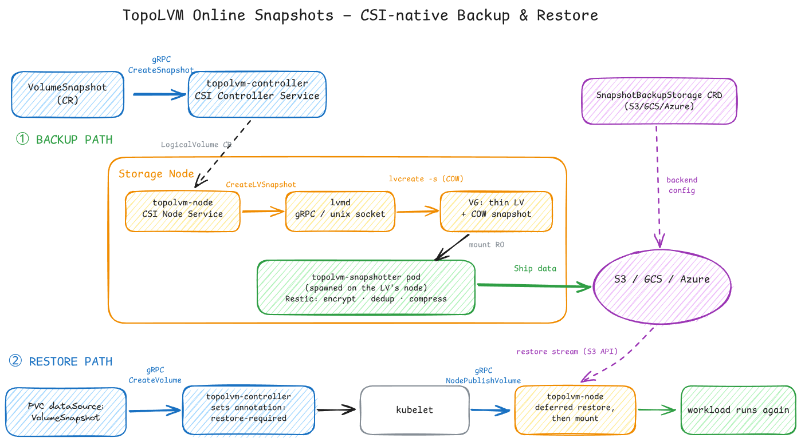

TopoLVM, a CSI driver for kubernetes, that brings native **Linux LVM** straight into your cluster. No replication layer, no network hop: volumes are carved from the node's local disks, so you get **near bare-metal I/O latency**. That's exactly why it's a favorite for databases in kubernetes **PostgreSQL, MySQL, Kafka, ClickHouse, and Elasticsearch**.

## But that node-local design comes with real trade-offs:

- No replication → no built-in high availability
- A volume can't outgrow a single node's capacity
- If the node dies, the volume dies with it
- And the one that bothered most: No backup to remote storage, no restore, nothing like what Longhorn offers out of the box.

For the storage layer that's already the performance king, that gap makes the node-failure story: your snapshots are sitting on the same disk that just died.

## At AppsCode, I built native off-cluster backup & restore for TopoLVM snapshots:

- A `VolumeSnapshot` creates an instant LVM thin snapshot while the workload keeps running.
- A snapshotter pod automatically runs on the node that owns the volume and mounts the snapshot read-only.
- Data is backed up to **S3, GCS, or Azure** with **encryption, deduplication, and compression** using Restic.
- Restore integrates with the standard **CSI** workflow and streams data back from object storage on the first mount.

**Result:** workloads can be restored onto any healthy node after a node failure instead of losing data.

## What this project taught me:

- CSI driver internals: how a PVC request travels through gRPC calls to the driver
- Linux LVM thin-pool and COW snapshot internals
- Deferred-restore semantics inside the CSI lifecycle
- Handling the ugly edge cases: PVC deleted mid-backup, executor pod killed externally, missing storage backends
- Building encryption/dedup/compression into a storage data path
- A monitoring dashboard for cluster-wide TopoLVM health and metrics (ongoing)

Everything is public, try it: [github.com/cloudnativestorage/topolvm/tree/main/example](https://github.com/cloudnativestorage/topolvm/tree/main/example)
